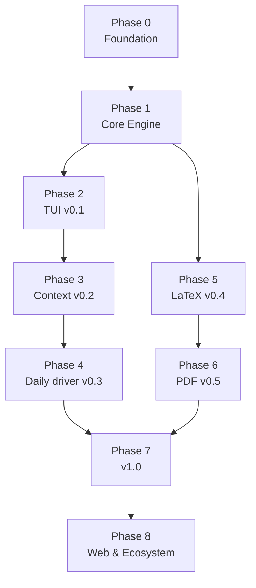

# Oxidiris — Backlog

> Spec source: [`docs/informations/proposals.md`](docs/informations/proposals.md).
> All `§x.y` references in this file point to the corresponding section of that spec.
>
> Target audience: This document is written so that an AI agent or contributor can independently pick a task and work on it without needing extra context. Each task is a self-contained unit of work with machine-verifiable acceptance criteria.

---

## How to Use This Document

### Task Pick Rules

1. Only pick tasks where all `Depends` are in the Done state. Do not do tasks ahead of their dependencies without permission.
2. Tasks labeled BLOCKED-BY-HUMAN require human decisions (see [Section D](#d-decisions-requiring-human-input)) — do not decide independently.
3. Tasks labeled Parallel-safe can be worked on concurrently with other tasks in the same phase without file conflicts.
4. Update task status in the overview table when starting (`In progress`) and when finished (`Done`).

### Task Metadata Format

```
Phase <number> · Depends <IDs|—> · Blocks <IDs|—> · Crate core|bin|repo
· Spec §<section> · Size S|M|L|XL
```

| Size | Estimate |
|---|---|
| S | < 100 lines of code, 1 file |
| M | 100–400 lines, a few files |
| L | 400–1000 lines, a complete module |
| XL | Needs further breakdown before starting — treat as an epic |

### Definition of Done (Applies to EVERY task)

A task is only marked as done when ALL of the following are satisfied:

- [ ] `cargo fmt --check` is clean
- [ ] `cargo clippy --all-targets -- -D warnings` is clean
- [ ] `cargo test --workspace` passes
- [ ] New tests cover new code (except purely configuration/documentation tasks)
- [ ] Architecture constraints strictly followed: `oxidiris-core` must NOT depend on `ratatui`, `crossterm`, or any terminal I/O crate (§1.1)
- [ ] New public APIs have rustdoc
- [ ] User-visible changes are added to `CHANGELOG.md` under `## [Unreleased]`
- [ ] Task-specific acceptance criteria are all checked off

### Git Conventions

- Branch: `<lowercase-id>/<short-description>` — e.g. `oxd-012/orp-algorithm`
- Commit: [Conventional Commits](https://www.conventionalcommits.org/) — `feat(core): ...`, `fix(tui): ...`, `test(core): ...`, `chore(ci): ...`
- Each task = one PR. PR description clearly states `Closes OXD-xxx`.

---

## Dependency Map



Critical path: `OXD-001 → OXD-010 → OXD-011 → OXD-012 → OXD-018 → OXD-021 → OXD-023`
— these seven tasks block almost everything else. Absolute priority.

---

## Current State

**Milestone v0.1 (OXD-027) is complete and tagged `v0.1.0`.** Phases 0-2 are implemented, tested
and verified against this file: `oxidiris BACKLOG.md` reads it as 6 047 tokens across 83 headings.
The release notes are in [`CHANGELOG.md`](CHANGELOG.md).

**Phase 3 is under way for v0.2.** OXD-030, 031, 032, 034 and 036 are done: the split view, the
outline sidebar, Review Mode and the modal keymap all work, and whole-screen golden frames guard
the layout. OXD-033 is nearly free (see its card) and OXD-035 is untouched; OXD-037 tags the
release once both land.

| | |
|---|---|
| Tests | 260 passing (83 engine, 163 terminal incl. 14 golden frames, 12 corpus, 2 doctests) |
| Gate | `make check` — fmt, clippy `-D warnings`, tests, wasm constraint |
| Verified | Anchor column fixed across the full Unicode corpus and asserted as a golden frame; deadline scheduler drift-free over 1 000 steps; no colour reaches the terminal under `NO_COLOR`; live pty session confirms key dispatch, help popup and terminal restore |

Deviations from the spec found during implementation are recorded in `docs/decisions/` and
back-annotated into the spec, per the note at the bottom of this file. So far: ADR 001
(`token-timing.md`), which replaced `Token::duration_ms` with a WPM-independent weight; ADR 002
(`split-view-layout.md`), which moved the status block out of the left column and made the panel a
width decision rather than a size-class one.

Known gaps carried forward, all deliberate and tracked:

- Search is Phase 4 (OXD-043)
- CJK still splits on whitespace only — blocked on **DEC-02**, not papered over
- `--theme`, `--chunk`, `--start`, `--no-resume`, `--config` parse but report themselves as
  unimplemented in the status bar rather than failing silently
- `-` (stdin) falls back to `--dump`: the TUI cannot read keys while stdin is a pipe. Proper
  support needs OXD-047
- **v0.1.0 as tagged does not build on the MSRV it declares.** It advertises 1.85; ratatui 0.30
  needs 1.88. Fixed on `main` by **OXD-005** (issue
  [#4](https://github.com/AlexanderSlokov/oxidiris/issues/4)), which turned CI green again, but
  the published tag keeps the wrong claim — it is recorded under that release's known limitations
  in `CHANGELOG.md` and corrected in v0.2.0

---

## Overview Table

| ID      | Task                                                                                       | Phase | Size | Depends              | Status  |
|---------|--------------------------------------------------------------------------------------------|-------|------|----------------------|---------|
| OXD-001 | Split Cargo workspace                                                                      | 0     | M    | —                    | ✅ Done |
| OXD-002 | Metadata & MSRV                                                                            | 0     | S    | OXD-001              | ✅ Done |
| OXD-003 | CI baseline                                                                                | 0     | M    | OXD-001              | ✅ Done |
| OXD-004 | `testdata/` corpus                                                                         | 0     | S    | OXD-001              | ✅ Done |
| OXD-005 | Correct MSRV & licence policy ([#4](https://github.com/AlexanderSlokov/oxidiris/issues/4)) | 0     | S    | OXD-002, OXD-003     | ✅ Done |
| OXD-010 | Token & Document data types                                                                | 1     | M    | OXD-001              | ✅ Done |
| OXD-011 | Unicode Segmenter                                                                          | 1     | M    | OXD-010              | ✅ Done |
| OXD-012 | ORP Algorithm                                                                              | 1     | M    | OXD-011              | ✅ Done |
| OXD-013 | Pacing Engine                                                                              | 1     | M    | OXD-010              | ✅ Done |
| OXD-014 | Sentence boundary heuristic                                                                | 1     | S    | OXD-013              | ✅ Done |
| OXD-015 | Encoding Detection                                                                         | 1     | S    | OXD-001              | ✅ Done |
| OXD-016 | Plain Text Parser                                                                          | 1     | M    | OXD-010              | ✅ Done |
| OXD-017 | Markdown Parser                                                                            | 1     | L    | OXD-016              | ✅ Done |
| OXD-018 | Player state machine                                                                       | 1     | L    | OXD-012, OXD-013     | ✅ Done |
| OXD-020 | CLI Framework (clap)                                                                       | 2     | M    | OXD-001              | ✅ Done |
| OXD-021 | Event loop + deadline clock                                                                | 2     | L    | OXD-018              | ✅ Done |
| OXD-022 | Terminal capability detection                                                              | 2     | M    | OXD-020              | ✅ Done |
| OXD-023 | RSVP Widget (anchor column)                                                                | 2     | L    | OXD-021, OXD-022     | ✅ Done |
| OXD-024 | Status bar & progress bar                                                                  | 2     | S    | OXD-023              | ✅ Done |
| OXD-025 | Help popup `?`                                                                             | 2     | S    | OXD-023              | ✅ Done |
| OXD-026 | `--dump` mode                                                                              | 2     | S    | OXD-017, OXD-020     | ✅ Done |
| OXD-027 | Milestone v0.1                                                                             | 2     | S    | OXD-023…026          | ✅ Done |
| OXD-030 | Modal keymap system                                                                        | 3     | M    | OXD-021              | ✅ Done |
| OXD-031 | Full-Text Panel + highlight                                                                | 3     | L    | OXD-030              | ✅ Done |
| OXD-032 | Outline / TOC Sidebar                                                                      | 3     | M    | OXD-031              | ✅ Done |
| OXD-033 | Backstep, Skip, paragraph jump (only `<n>%` left)                                          | 3     | S    | OXD-030              | ⬜ Todo |
| OXD-034 | Review Mode                                                                                | 3     | M    | OXD-031              | ✅ Done |
| OXD-035 | Ramp-up on resume                                                                          | 3     | S    | OXD-018              | ⬜ Todo |
| OXD-036 | TUI Snapshot test                                                                          | 3     | M    | OXD-023              | ✅ Done |
| OXD-037 | Milestone v0.2                                                                             | 3     | S    | OXD-005, OXD-030…036 | ⬜ Todo |
| OXD-040 | Theme system                                                                               | 4     | M    | OXD-022              | ⬜ Todo |
| OXD-041 | TOML config file                                                                           | 4     | M    | OXD-020              | ⬜ Todo |
| OXD-042 | Custom keybindings                                                                         | 4     | M    | OXD-030, OXD-041     | ⬜ Todo |
| OXD-043 | Search `/`                                                                                 | 4     | M    | OXD-031              | ⬜ Todo |
| OXD-044 | Bookmarks                                                                                  | 4     | S    | OXD-033              | ⬜ Todo |
| OXD-045 | History & auto-resume                                                                      | 4     | M    | OXD-044              | ⬜ Todo |
| OXD-046 | Chunking mode                                                                              | 4     | M    | OXD-012              | ⬜ Todo |
| OXD-047 | Read from stdin                                                                            | 4     | S    | OXD-020              | ⬜ Todo |
| OXD-048 | Milestone v0.3                                                                             | 4     | S    | OXD-040…047          | ⬜ Todo |
| OXD-050 | LaTeX Parser                                                                               | 5     | L    | OXD-017              | ⬜ Todo |
| OXD-051 | Formula display strategy                                                                   | 5     | M    | OXD-050              | ⬜ Todo |
| OXD-052 | Typst Parser                                                                               | 5     | M    | OXD-051              | ⬜ Todo |
| OXD-060 | Spike: PDF extraction                                                                      | 6     | M    | OXD-017              | ⬜ Todo |
| OXD-061 | PDF De-columnizing                                                                         | 6     | XL   | OXD-060              | ⬜ Todo |
| OXD-062 | Lazy parsing & cache                                                                       | 6     | L    | OXD-018              | ⬜ Todo |
| OXD-070 | EPUB Parser                                                                                | 7     | L    | OXD-062              | ⬜ Todo |
| OXD-071 | HTML / Readability Parser                                                                  | 7     | M    | OXD-017              | ⬜ Todo |
| OXD-072 | `criterion` Benchmark                                                                      | 7     | S    | OXD-017              | ⬜ Todo |
| OXD-073 | Parser Fuzzing                                                                             | 7     | M    | OXD-017              | ⬜ Todo |
| OXD-074 | Accessibility (a11y) audit                                                                 | 7     | M    | OXD-040              | ⬜ Todo |
| OXD-075 | Rewrite README + demo                                                                      | 7     | M    | OXD-027              | ⬜ Todo |
| OXD-076 | Project documentation                                                                      | 7     | S    | —                    | ⬜ Todo |
| OXD-077 | Packaging & distribution                                                                   | 7     | M    | OXD-003              | ⬜ Todo |
| OXD-078 | Milestone v1.0                                                                             | 7     | S    | OXD-070…077          | ⬜ Todo |
| OXD-080 | WebAssembly Bindings                                                                       | 8     | L    | OXD-018              | ⬜ Todo |
| OXD-081 | Interactive landing page                                                                   | 8     | L    | OXD-080              | ⬜ Todo |
| OXD-082 | Neovim Plugin                                                                              | 8     | XL   | OXD-078              | ⬜ Todo |
| OXD-083 | VS Code Extension                                                                          | 8     | XL   | OXD-080              | ⬜ Todo |

---

# A. Phase 0 — Foundation

> These four tasks block everything else. Complete all four before moving to Phase 1.

---

### OXD-001 · Split Cargo workspace

Phase 0 · Depends — · Blocks all · Crate repo · Spec §1, §1.1 · Size M

The repo is currently a single-crate `oxidiris/src/main.rs`. Convert to a two-crate workspace. The cost right now is nearly 0; leaving it for later will be very expensive because `core` might accidentally pull in TUI dependencies.

Scope
- Create root `Cargo.toml` workspace with `members = ["crates/*"]` and `[workspace.dependencies]`.
- Move current code to `crates/oxidiris/`.
- Create `crates/oxidiris-core/` with empty `lib.rs`.
- Set up module directory tree according to §1.1 (empty files with `//!` doc comments are sufficient).
- `crates/oxidiris` declares `oxidiris-core = { path = "../oxidiris-core" }`.

Acceptance
- [ ] `cargo build --workspace` succeeds
- [ ] `cargo tree -p oxidiris-core` does NOT contain `ratatui`, `crossterm`, `clap`
- [ ] `cargo build -p oxidiris-core --target wasm32-unknown-unknown` succeeds
- [ ] `cargo run -p oxidiris` still runs

---

### OXD-002 · Metadata & MSRV

Phase 0 · Depends OXD-001 · Crate repo · Spec §1.2, §9.4 · Size S · Parallel-safe

Scope
- Add to `[workspace.package]`: `license`, `repository`, `readme`, `keywords`, `categories`, `authors`, `rust-version`. Edition 2024 needs 1.85, but ratatui 0.30 pulls the real floor up to `1.88` — the declared value must match what CI's MSRV job builds with.
- Create `rust-toolchain.toml` to pin the version.
- Document MSRV in README.

> Field `license` depends on DEC-01. If DEC-01 is not finalized, temporarily use `GPL-3.0-or-later` for both crates and leave a `TODO` pointing to DEC-01.

Acceptance
- [ ] `cargo publish --dry-run -p oxidiris-core` reports no missing fields
- [ ] `rust-version` matches `rust-toolchain.toml`

---

### OXD-003 · CI baseline

Phase 0 · Depends OXD-001 · Crate repo · Spec §9.3 · Size M · Parallel-safe

Scope — `.github/workflows/ci.yml` with jobs:
- `fmt`: `cargo fmt --all --check`
- `clippy`: `cargo clippy --all-targets --all-features -- -D warnings`
- `test`: matrix ubuntu-latest, macos-latest, windows-latest
- `wasm`: `cargo build -p oxidiris-core --target wasm32-unknown-unknown` — this job enforces the architecture constraint in §1.1, do not delete
- `msrv`: build with exact MSRV version
- `deny`: `cargo deny check` + `deny.toml` file

Acceptance
- [ ] All 6 jobs pass on a test PR
- [ ] `wasm` job fails when `ratatui` is intentionally added to `oxidiris-core` (manually verified)
- [ ] Caching `~/.cargo` and `target/` to keep CI under 5 minutes

---

### OXD-004 · `testdata/` corpus

Phase 0 · Depends OXD-001 · Crate repo · Spec §9.1 · Size S · Parallel-safe

Sample file collection shared across all parser/tokenizer tests.

Scope — create `testdata/` containing at minimum:

| File | Purpose |
|---|---|
| `simple.txt` | Basic ASCII text |
| `vietnamese_nfc.txt` | Vietnamese text in NFC format |
| `vietnamese_nfd.txt` | Same content in NFD format |
| `cjk.txt` | Chinese/Japanese text |
| `emoji_zwj.txt` | ZWJ sequence emojis, national flags |
| `mixed_width.txt` | Mixed ASCII + CJK + emoji on single line |
| `abbreviations.txt` | `Fig. 3`, `et al.`, `i.e.`, `v1.2.3`, `Dr.`, `std::fmt` |
| `long_words.txt` | Long URLs, git hashes, 40-char function names |
| `sample.md` | Comprehensive Markdown: headings, lists, code blocks, tables, links, blockquotes |
| `rfc_style.txt` | Hard line breaks wrapped at column 72 |
| `utf16_bom.txt` | UTF-16 file with BOM |
| `latin1.txt` | Latin-1 file |
| `empty.txt` | Empty file |

Acceptance
- [ ] `testdata/README.md` describes the purpose of each file
- [ ] Unicode files are verified to be in correct normalization form (with `verify.sh` script or test)

---

### OXD-005 · Correct the declared MSRV and the licence policy

Phase 0 · Depends OXD-002, OXD-003 · Blocks OXD-037 · Crate repo · Spec §9.3, §9.4 · Size S
· Issue [#4](https://github.com/AlexanderSlokov/oxidiris/issues/4)

Two CI jobs have failed on `main` since before the v0.1.0 tag. Full diagnosis is in issue #4;
the summary is that both are defects in project metadata, and `make check` cannot detect either.

The MSRV bump changes the project's compatibility promise, so this ships in **v0.2.0**, not as a
patch to v0.1.0. v0.1.0 remains tagged as released, with the incorrect claim recorded under its
known limitations in `CHANGELOG.md`.

Scope
- `rust-version = "1.88"` in `[workspace.package]`. Edition 2024 only needs 1.85, but `ratatui`
  0.30 and its tree (`darling`, `instability`, `time`) require 1.88, so the workspace has never
  built on the declared value.
- Pin the CI MSRV job to the same version, and state 1.88 in README, CHANGELOG and spec §9.4.
- `deny.toml`: grant `GPL-3.0-or-later` to `oxidiris` and `oxidiris-core` through `exceptions`.
  cargo-deny evaluates workspace members, so the permissive-only allow-list currently rejects the
  project's own crates. The dependency allow-list itself must stay permissive-only.
- Add a `make msrv` target that builds on the declared MSRV, reading the value out of the manifest
  so the two cannot drift. Add `msrv` and `audit` to `make ci`.
- Correct the Makefile header, which claims a green `make check` means a green pipeline. It does
  not: `make check` runs on whatever toolchain is active and never invokes `cargo deny`.

Acceptance
- [ ] `cargo +1.88 build --workspace` succeeds
- [ ] `make msrv` fails with a clear message when the MSRV toolchain is not installed
- [ ] `cargo deny check` reports `licenses ok`
- [ ] Adding a GPL dependency still fails the licence check (manually verified)
- [ ] No file declares or promises 1.85 any more (explaining why it was wrong is fine)
- [ ] All 6 CI jobs green on `main`

---

# B. Phase 1 — Core Engine (`oxidiris-core`)

> This entire phase contains zero TUI lines. This part is reused for wasm in Phase 8.

---

### OXD-010 · Token & Document Data Types

Phase 1 · Depends OXD-001 · Blocks OXD-011, 013, 016 · Crate core · Spec §4.1 · Size M

Data foundation for the entire engine. Flawed design here will ripple everywhere.

Scope
```rust
pub struct Token {
    pub text: String,
    pub orp_index: usize,        // ORP grapheme index
    pub display_width: u16,      // total column width
    pub orp_offset: u16,         // column width of portion before ORP
    pub duration_ms: u32,
    pub kind: TokenKind,
    pub block_id: usize,
    pub byte_span: Range<usize>, // points back to original text
}

pub enum TokenKind { Word, Code, Math, Heading(u8), ListItem, Citation, Table }

pub struct Document {
    pub source: String,          // original text, preserved as-is
    pub blocks: Vec<Block>,
    pub headings: Vec<Heading>,  // flat TOC tree with levels
    pub metadata: DocumentMeta,
}
```

Design Notes
- `byte_span` enables Full-Text panel highlighting (OXD-031) and Review Mode (OXD-034). Mandatory from day one; adding it later requires modifying every parser.
- `orp_offset` is pre-calculated in core so the renderer only does subtraction, eliminating recalculation every frame.

Acceptance
- [ ] All types implement `Debug + Clone + PartialEq`
- [ ] `serde` support under `serde` feature flag (used for caching in OXD-062)
- [ ] Rustdoc explains the purpose of `byte_span` and `orp_offset`

---

### OXD-011 · Unicode Segmenter

Phase 1 · Depends OXD-010 · Blocks OXD-012 · Crate core · Spec §3.1.1, §8.6 · Size M

Segment text into words, correctly handling the three Unicode traps in §3.1.1.

Scope
- Normalize to NFC (`unicode-normalization`) before any other operations.
- Word segmentation according to UAX #29 (`unicode-segmentation`).
- Calculate `display_width` according to UAX #11 (`unicode-width`), NOT character count (`char`).
- Strip control characters and bidi overrides.
- ZWJ joined emojis are treated as a single grapheme.

Acceptance — mandatory tests using corpus OXD-004:
- [ ] `vietnamese_nfc.txt` and `vietnamese_nfd.txt` produce identical token streams
- [ ] `"日本語"` → `display_width == 6`, `grapheme_count == 3`
- [ ] Flag emojis and ZWJ family emojis are not split
- [ ] Empty file → empty `Vec`, no panic

---

### OXD-012 · ORP Algorithm

Phase 1 · Depends OXD-011 · Blocks OXD-018, 023, 046 · Crate core · Spec §3.1.2, §3.1.3 · Size M

Most critical task in the project. If ORP is wrong, the tool loses its primary value.

Scope
- Function `orp_index(word: &str) -> usize` according to lookup table in §3.1.2.
- Function `orp_offset(word: &str) -> u16` — sum of display-width of graphemes before ORP.
- Handle all 4 edge cases in the table at the end of §3.1.3.

Acceptance — mandatory test suite per §9.1:
- [ ] 1-char word → index 0
- [ ] 20-char word → index 4 (capped)
- [ ] Vietnamese NFC and NFD yield identical results
- [ ] CJK full-width: offset correctly calculated by column width, not character index
- [ ] ZWJ emojis do not offset index
- [ ] Property test (`proptest`): for any valid Unicode string, `orp_index < grapheme_count` and `orp_offset <= display_width` — core invariant against text jumping columns
- [ ] Lookup table declared as data (const array), not nested `if-else`, for easy tuning when DEC-03 is finalized

---

### OXD-013 · Pacing Engine

Phase 1 · Depends OXD-010 · Blocks OXD-018 · Crate core · Spec §3.2.1 · Size M · Parallel-safe with OXD-011/012

Scope
- Implement formula in §3.2.1: `base × length_factor × punctuation_factor × kind_factor + structural_pause`.
- Declare coefficient tables in §3.2.1 as constants for easy tuning.
- `Pacing::Linear` mode bypasses all multipliers (for `--pacing linear`).
- Function to compute effective WPM across full document (§3.2.4).

Acceptance
- [ ] In `Pacing::Linear`, all tokens have equal `duration_ms`
- [ ] Tokens ending with `.` have duration ≈ 2.25× regular tokens of same length
- [ ] `length_factor` capped at 2.0
- [ ] Effective WPM always ≤ configured WPM; typically 75–85% for standard English text
- [ ] No division by zero at extremely small `wpm` (clamp `wpm` to `[50, 1500]`)

---

### OXD-014 · Sentence Boundary Heuristic

Phase 1 · Depends OXD-013 · Crate core · Spec §3.2.2 · Size S

Prevent `Fig. 3` from being misinterpreted as sentence end, causing unnecessary 2.25× pauses.

Scope
- Abbreviation list (`et al.`, `i.e.`, `e.g.`, `vs.`, `No.`, `Fig.`, `Eq.`, `Dr.`, `Prof.`, `cf.`, `etc.`…) — declared as const set.
- Additional heuristic: if next token begins with lowercase letter or digit → not sentence end.
- Do not split on dots in numbers (`3.14`), versions (`v1.2.3`), and Rust paths (`::`).

Acceptance
- [ ] Entire `testdata/abbreviations.txt` produces zero false sentence-end pauses
- [ ] `"Finished."` followed by `"Sentence"` is still recognized as sentence end

---

### OXD-015 · Encoding Detection

Phase 1 · Depends OXD-001 · Crate core · Spec §4.3 · Size S · Parallel-safe

Scope
- BOM detection (UTF-8, UTF-16 LE/BE); fallback detection via `encoding_rs`.
- Support Latin-1 for legacy RFCs/manpages.
- Return explicit errors instead of panicking on invalid bytes.

Acceptance
- [ ] `utf16_bom.txt` and `latin1.txt` read correctly
- [ ] Random binary file → returns readable `Err`, no panic
- [ ] `empty.txt` → empty string, no error

---

### OXD-016 · Plain Text Parser

Phase 1 · Depends OXD-010 · Blocks OXD-017 · Crate core · Spec §8.5 · Size M

Simplest parser — acts as trait reference for all subsequent parsers.

Scope
- Define `trait Parser { fn parse(&self, input: &str) -> Result<Document> }`.
- Paragraph detection via double newlines.
- Unwrap hard wrapped lines: RFC-style files wrapped at column 72 must be unwrapped, otherwise each line becomes a separate paragraph (§8.5).

Acceptance
- [ ] `simple.txt` → block count matches actual paragraph count
- [ ] `rfc_style.txt` unwrapped properly, not split into dozens of pseudo-paragraphs
- [ ] Every `byte_span` points to correct position in `source` (test: slice `source[span]` equals `token.text` after normalization)

---

### OXD-017 · Markdown Parser

Phase 1 · Depends OXD-016 · Blocks OXD-026, 050, 071 · Crate core · Spec §8.1 · Size L

Scope — use `pulldown-cmark`, flatten AST to token stream:
- Headings → `TokenKind::Heading(level)` + populate `Document::headings` (data for TOC OXD-032).
- Code blocks → `TokenKind::Code`, kept monolithic, words not split.
- Links/Images → preserve display text only, strip URLs.
- Lists/Blockquotes → attach `structural_pause`.
- Tables → `TokenKind::Table`, skipped in RSVP stream, preserved as block for right panel (§8.1).

Acceptance
- [ ] `sample.md` parses to correctly structured heading hierarchy
- [ ] No URLs leak into token stream
- [ ] Code blocks preserved intact without word splitting
- [ ] Golden test via `insta`: `sample.md` → snapshot token stream
- [ ] `byte_span` remains accurate despite stripped markup

---

### OXD-018 · Player State Machine

Phase 1 · Depends OXD-012, OXD-013 · Blocks OXD-021, 080 · Crate core · Spec §4.1 · Size L

The core reader logic — pure core, zero terminal dependencies, allowing wasm (OXD-080) to reuse it directly.

Scope
```rust
pub struct Player { /* tokens, cursor, wpm, state, ... */ }

impl Player {
    pub fn play(&mut self);
    pub fn pause(&mut self);
    pub fn tick(&mut self) -> Option<&Token>;  // advance one token
    pub fn seek_word(&mut self, delta: isize);
    pub fn seek_paragraph(&mut self, delta: isize);
    pub fn seek_percent(&mut self, pct: f32);
    pub fn set_wpm(&mut self, wpm: u16);
    pub fn progress(&self) -> (usize, usize);
    pub fn current_duration(&self) -> Duration;
}
```

Note: `Player` does NOT call `sleep` or `Instant::now()`. It only returns desired duration; scheduling belongs to OXD-021. Essential requirement for deterministic mock-time testing.

Acceptance
- [ ] Fully testable without real-time delays (no `sleep` in tests)
- [ ] `seek_word` safely clamped at doc bounds, no panics or overflows
- [ ] `set_wpm` mid-stream updates duration for subsequent tokens only, not retroactively
- [ ] Empty document: all operations safe

---

# C. Phase 2 — TUI v0.1 (`focus` mode)

> Phase goal: readable README of the project itself, zero column jumping.

---

### OXD-020 · CLI Framework (clap)

Phase 2 · Depends OXD-001 · Blocks OXD-022, 026, 041, 047 · Crate bin · Spec §6 · Size M

Scope — clap derive API, covering all flags in §6 table (future flags can initially `todo!()` with "unsupported" message):

`<file>` · `-w/--wpm` (default 300) · `-m/--mode` · `--pacing` · `--theme` · `--dump` · `--chunk` · `--start` · `--no-resume` · `--config`

Acceptance
- [ ] `--help` displays practical usage examples
- [ ] WPM outside `[50, 1500]` rejected with clean error message
- [ ] Non-existent file → exit code 1 with readable error, no panic (§4.4)
- [ ] CLI tests using `assert_cmd`

---

### OXD-021 · Event Loop + Deadline Clock

Phase 2 · Depends OXD-018 · Blocks OXD-023, 030 · Crate bin · Spec §4.2 · Size L

Second critical foundational task. Flaws here cause reader jitter that cannot be patched over.

Scope
- Thread reading `crossterm` events → `mpsc::channel`.
- Main loop `recv_timeout(deadline - now)`.
- Absolute deadline scheduling: `next_word_at += duration`, NEVER `Instant::now() + duration` (§4.2).
- Handle missed deadlines (system sleep/suspend): catch-up skip, no queue congestion.
- Render only on state change, no fixed frequency redrawing.
- Handle resize events.
- Gracefully restore terminal on exit AND on panic (install panic hook).

Acceptance
- [ ] Drift test: simulate 1000 tokens at 300 WPM, total deviation < 1% vs theoretical time
- [ ] Keypress response time under 50 ms during playback
- [ ] `Ctrl-C` and panics cleanly restore terminal (no raw mode leftover)
- [ ] CPU usage near 0% when paused

---

### OXD-022 · Terminal Capability Detection

Phase 2 · Depends OXD-020 · Blocks OXD-023, 040 · Crate bin · Spec §3.4.4 · Size M · Parallel-safe

Scope
- Respect `NO_COLOR`.
- Color fallback hierarchy via `COLORTERM`/`TERM`: truecolor → 256 → 16.
- Detect Unicode support; fallback `▼ ▲` → `v ^`.
- Minimum screen threshold 80×24: below threshold auto-switch to `focus` mode; below that show resize prompt instead of broken layout.

Acceptance
- [ ] `NO_COLOR=1` → zero color escape sequences output
- [ ] `TERM=dumb` does not crash application
- [ ] 40×10 terminal displays polite resize prompt, no layout breakage

---

### OXD-023 · RSVP Widget (Anchor Column)

Phase 2 · Depends OXD-021, OXD-022 · Blocks OXD-024, 031, 036 · Crate bin · Spec §3.1.3, §3.4.1, §5 · Size L

The signature widget of the product.

Scope
- Implement alignment algorithm §3.1.3: anchor column `A = W/2` strictly fixed.
- Mark ORP with accent color AND geometric marker (`▼ ▲`) — mandatory per WCAG SC 1.4.1 (§3.4.1), not aesthetic choice.
- Handle 4 edge cases in §3.1.3 (words longer than frame, negative padding, 1-char word, numeric strings).
- Recalculate anchor column on resize.

Acceptance
- [ ] Core invariant: for every word in corpus OXD-004, ORP character is rendered exactly at column `A` — verified via `TestBackend` snapshot tests
- [ ] Words longer than frame truncated with `…`, no overflow
- [ ] Color disabled (`NO_COLOR`) → ORP still clearly identifiable via `▼ ▲`
- [ ] Continuous resizing causes no layout breakdown

---

### OXD-024 · Status & Progress Bar

Phase 2 · Depends OXD-023 · Crate bin · Spec §3.3, §5 · Size S

Scope — matching mockup §5:
- `speed: 450 WPM (eff. 361)` — display both numbers (§3.2.4).
- `word: 45/999 (42%)` — word units, not lines.
- Visual progress bar.
- Minimal keybinding hints.

Acceptance
- [ ] Effective WPM updates when WPM changes
- [ ] No line wrapping on 80-column terminal
- [ ] Percentage matches `Player::progress()`

---

### OXD-025 · Help Popup `?`

Phase 2 · Depends OXD-023 · Crate bin · Spec §7 · Size S · Parallel-safe

Scope — overlay showing keybindings, closed with `?` or `Esc`. Content generated from single source of truth shared with key event handler.

Acceptance
- [ ] Opening popup automatically pauses playback
- [ ] Popup content generated dynamically from keymap table, not hardcoded
- [ ] Scrollable on short terminal screens

---

### OXD-026 · `--dump` Mode

Phase 2 · Depends OXD-017, OXD-020 · Crate bin · Spec §3.4.3 · Size S

Debug tool for parser AND genuine accessibility fallback for screen reader users.

Scope
- Output stripped plain text to stdout, preserving paragraph boundaries.
- Auto-enable when stdout is not TTY (§4.4) — allowing `oxidiris a.md | less`.

Acceptance
- [ ] `oxidiris sample.md --dump` yields readable output without ANSI escape codes
- [ ] `oxidiris sample.md | cat` automatically switches to dump mode
- [ ] Exit code 0

---

### OXD-027 · Milestone v0.1

Phase 2 · Depends OXD-023, 024, 025, 026 · Crate repo · Size S

Milestone acceptance criteria:
- [ ] `oxidiris README.md` runs and reads full document
- [ ] Visual verification: zero text jumping across entire run
- [ ] Works with `.txt` and `.md`
- [ ] Tag `v0.1.0`, update `CHANGELOG.md`

---

# D. Phase 3 — Context Features (v0.2)

> Reminding §0.2: features in this phase are not secondary. They compensate for RSVP eliminating spatial regression — the fundamental flaw of RSVP.

---

### OXD-030 · Modal Keymap System

Phase 3 · Depends OXD-021 · Blocks OXD-031, 033, 042 · Crate bin · Spec §7.1 · Size M

Resolves key conflict in §7.1: `J/K` adjusts WPM in Reader mode but scrolls in Browser mode.

Scope
- `enum Mode { Reader, Browser, Outline }`.
- Keymap data table defined per mode — shared between OXD-025 and OXD-042.
- Explicit distinction between `Esc` (exit sub-mode) and `q` (quit app) per §7.2 note.

Acceptance
- [x] `J` changes WPM in Reader, scrolls in Browser
- [x] `Esc` in Browser returns to Reader, does not quit app
- [x] Keymap data structure enumerable for help popup — `bindings_for(mode)` drives the help
      popup and the status hints, so neither can advertise a key that does something else here

---

### OXD-031 · Full-Text Panel + Highlighting

Phase 3 · Depends OXD-030 · Blocks OXD-032, 034, 043 · Crate bin · Spec §5 · Size L

Scope
- Split-screen layout matching mockup §5.
- Display `nano`-style text, auto-scrolling with reading cursor.
- Highlight current token based on `byte_span` — primary context anchor preventing disorientation.
- `Tab` switches focus; manual scrolling enabled when paused.

> The panel renders `Document::source`, markup included, because that is what `byte_span` indexes.
> Rendering stripped block text would need a second mapping that could disagree with the first, and
> a highlight on the wrong word is worse than no panel. The §5 mockup draws it this way too.
>
> Known limit, by design: for Markdown escapes and character entities the fragment's text is not a
> verbatim copy of its source range, and `pacing::word_span` falls back to highlighting the whole
> fragment. A slightly coarse highlight beats a range that panics on slicing.

Acceptance
- [x] Highlight strictly matches currently displayed token in left panel
- [x] Auto-scroll keeps current token within visible viewport
- [x] Auto-hide right panel when terminal < 80 columns (§3.4.4) — on width alone, see ADR 002

---

### OXD-032 · Outline / TOC Sidebar

Phase 3 · Depends OXD-031 · Crate bin · Spec §3.3 · Size M

Scope
- Hierarchical heading tree from `Document::headings` (populated via OXD-017).
- Key `o` toggles panel, `Enter` jumps RSVP cursor to selected heading.
- Highlight heading containing active reading position.

Acceptance
- [x] `Enter` jumps to exact location and returns to Reader mode
- [x] Document without headings → friendly empty state notice, no confusing empty panel
- [x] Nested heading levels rendered with proper indentation

---

### OXD-033 · Backstep, Skip, Paragraph Jump

Phase 3 · Depends OXD-030 · Blocks OXD-044 · Crate bin · Spec §3.3, §7.2 · Size M

Scope — `H`/`←` back 5 words · `L`/`→` forward 5 words · `[`/`]` jump paragraph · `g`/`G` start/end · `<n>%` jump percentage.

> Note: Paragraph boundary defined by parser `block_id`, not text heuristics — LaTeX/PDF paragraph boundaries differ significantly from Markdown (§3.3).

> **Mostly shipped in v0.1.0.** Every binding above except `<n>%` is already in
> `keymap.rs::BINDINGS` and backed by `Player::{seek_words, seek_blocks, goto_start, goto_end}`;
> `Player::seek_ratio` exists too. What remains is the numeric prefix — reading digits before `%`
> needs a pending-input state, which is why this now sits after OXD-030 rather than beside it.
> Real remaining size: **S**. Wiring `--start <n%|word:n>` belongs here too.

Acceptance
- [x] Seeking at doc boundaries cleanly clamped
- [x] Paragraph jumps use `block_id`, functioning across `.txt` and `.md`
- [ ] Entering `50%` jumps precisely to midpoint of document
- [ ] `--start 50%` starts there and stops reporting itself as unimplemented

---

### OXD-034 · Review Mode

Phase 3 · Depends OXD-031 · Crate bin · Spec §3.3 · Size M

Direct countermeasure against RSVP eliminating spatial regression (§0.2) — restores controlled "backward glance" capability.

Scope
- Key `v` displays full paragraph just read in static text form (reconstructed via `byte_span`).
- Auto-pause when opened; `Esc` closes and resumes reading.

Acceptance
- [x] Displays exact original paragraph text, including stripped markup
- [x] Paragraphs longer than screen are scrollable
- [x] Closing resumes playback at exact previous position — and a finished document is not
      silently restarted by closing the popup

---

### OXD-035 · Ramp-up on Resume

Phase 3 · Depends OXD-018 · Crate core · Spec §3.2.3 · Size S · Parallel-safe

Scope — on resume: rewind 2 words, start at 60% target WPM, linearly ramp up to 100% over 5 words. Applies to initial play as well.

Acceptance
- [ ] Resume always rewinds 2 words (unless at start of document)
- [ ] First token after resume has duration ≈ 1.67× compared to steady state
- [ ] After 5 words, duration returns to standard value
- [ ] Configurable setting to disable

---

### OXD-036 · TUI Snapshot Test

Phase 3 · Depends OXD-023 · Crate bin · Spec §9.1 · Size M · Parallel-safe

Scope — `ratatui::backend::TestBackend` + `insta`, covering: focus mode, split view, help popup, outline, terminal sizes 80×24 / 200×50 / 40×10, color and `NO_COLOR`.

> Two grids are captured per frame: the characters, and a style grid that records how each cell is
> emphasised. The §3.4.1 guarantees are about attributes, so an ORP that quietly stopped being bold
> would pass a text-only snapshot.

Acceptance
- [x] Snapshots deterministic across test runs
- [x] Test confirms ORP column invariant across varying word lengths
- [ ] Runs in CI across all 3 OS platforms — pending the first CI run on the Phase 3 PR.
      `.gitattributes` pins `*.snap` to LF so a Windows checkout cannot fail them spuriously

---

### OXD-037 · Milestone v0.2

Phase 3 · Depends OXD-030…036 · Size S

- [ ] Read long Markdown documents, precise rewind
- [ ] Split view, Outline, Backstep, progress bar fully operational
- [ ] Tag `v0.2.0`

---

# E. Phase 4 — Daily Driver (v0.3)

---

### OXD-040 · Theme System

Phase 4 · Depends OXD-022 · Blocks OXD-074 · Crate bin · Spec §3.4 · Size M

Scope — `dark` · `light` · `solarized`, each with 16-color fallback palette (§3.4.4).

Acceptance
- [ ] All text/background color pairs meet contrast ratio ≥ 7:1 (WCAG AAA) — automated mathematical contrast test
- [ ] Every theme functions across all 3 color capability tiers
- [ ] Colorblindness simulation test (deuteranopia): ORP remains distinguishable

---

### OXD-041 · TOML Configuration File

Phase 4 · Depends OXD-020 · Blocks OXD-042 · Crate bin · Spec §6.1 · Size M

Scope — `~/.config/oxidiris/config.toml` following XDG (`directories` crate), schema per §6.1. Priority order: CLI flag > env var > config file > default.

Acceptance
- [ ] Missing config file → uses defaults without error
- [ ] Invalid syntax → clear warning with line number, falls back to defaults
- [ ] Test verifies correct 4-tier precedence resolution

---

### OXD-042 · Custom Keybindings

Phase 4 · Depends OXD-030, OXD-041 · Crate bin · Spec §6.1 · Size M

Scope — `[keybindings]` section remapping keys per mode; conflict detection on load.

Acceptance
- [ ] Remapping `pause` key works as expected
- [ ] Conflicting keys within same mode → warning on startup
- [ ] Help popup (OXD-025) reflects remapped keys

---

### OXD-043 · Search `/`

Phase 4 · Depends OXD-031 · Crate bin · Spec §3.3 · Size M

Scope — `/` opens input field, `n`/`N` navigates next/prev match, highlights all matches in right panel. Case-insensitive and diacritic-insensitive matching.

Acceptance
- [ ] Searches Vietnamese text regardless of NFC or NFD encoding
- [ ] `n` wraps around at end of matches
- [ ] No matches → notice displayed, position unchanged

---

### OXD-044 · Bookmarks

Phase 4 · Depends OXD-033 · Blocks OXD-045 · Crate bin · Spec §3.3 · Size S

Scope — `m` sets mark, `'` jumps to mark; saved in history (OXD-045).

Acceptance
- [ ] Bookmarks persist across sessions
- [ ] Multiple bookmarks per file listed in selection menu

---

### OXD-045 · History & Auto-Resume

Phase 4 · Depends OXD-044 · Crate bin · Spec §7.4 · Size M

Scope — `~/.cache/oxidiris/history.json`. Following 4 specification details in §7.4:
- Lookup key = content hash, not file path.
- Save bookmarks alongside history.
- Cap at 500 recent entries.
- `--no-resume` flag to bypass.

Acceptance
- [ ] Renaming/moving file → preserves reading position
- [ ] Modifying file content → invalidates old position (reason for content hashing)
- [ ] Corrupted history file → silently ignored, does not block file opening
- [ ] Record count strictly ≤ 500

---

### OXD-046 · Chunking Mode

Phase 4 · Depends OXD-012 · Crate core · Spec §8.6 · Size M

Scope — `--chunk n` displays multiple words per step. When `chunk > 1`, ORP calculated for multi-word phrase as single unit.

> Default value for Vietnamese text depends on DEC-04.

Acceptance
- [ ] `--chunk 3` displays 3 words, ORP anchored properly for whole phrase
- [ ] Chunks do not cross sentence/paragraph boundaries
- [ ] Chunk duration = sum of constituent word durations

---

### OXD-047 · Read from Stdin

Phase 4 · Depends OXD-020 · Crate bin · Spec §6 · Size S · Parallel-safe

Scope — `oxidiris -` reads stdin; detects format from content; opens separate TTY for TUI control.

Acceptance
- [ ] `cat sample.md | oxidiris -` launches TUI normally
- [ ] `curl ... | oxidiris -` works properly
- [ ] Empty stdin → friendly error message

---

### OXD-048 · Milestone v0.3

Phase 4 · Depends OXD-040…047 · Size S

- [ ] Meets "daily driver" criteria in §2
- [ ] Tag `v0.3.0`

---

# F. Phase 5 — Academic Support (v0.4)

---

### OXD-050 · LaTeX Parser

Phase 5 · Depends OXD-017 · Blocks OXD-051 · Crate core · Spec §8.2 · Size L

Scope
- Detect math environments (`$...$`, `$$...$$`, `\begin{equation}`, `align`) → `TokenKind::Math`, do not tokenize into raw symbols like `\alpha`, `\frac`.
- `\cite{...}`, `\ref{...}` → replace with short label, strip internal keys.
- Strip preamble and `%` comments.
- `\section{}` → TOC headings.

Acceptance
- [ ] Parses real `.tex` file from arXiv (added to `testdata/`)
- [ ] Zero raw LaTeX commands leak into token stream
- [ ] Golden test via `insta`

---

### OXD-051 · Formula Display Strategy

Phase 5 · Depends OXD-050 · Blocks OXD-052 · Crate bin · Spec §8.2 · Size M

Scope — render math formulas as monolithic units with custom display duration. Consider basic verbalization (`\alpha` → "alpha", `\sum` → "sum").

Acceptance
- [ ] Formula rendered intact within frame, no overflow
- [ ] Duration proportional to formula complexity
- [ ] Formulas wider than frame handled cleanly

---

### OXD-052 · Typst Parser

Phase 5 · Depends OXD-051 · Crate core · Spec §8.2 · Size M

Scope — use `typst-syntax`, reuse formula display strategy from OXD-051.

Acceptance
- [ ] Parses sample `.typ` file
- [ ] Headings and formulas treated consistently with LaTeX pipeline

---

# G. Phase 6 — PDF Support (v0.5)

> Scope warning (§8.2): PDF de-columnizing is complex and can easily consume the entire project timeline. Mandatory to execute OXD-060 (spike) first and accept its outcome, even if the conclusion is "use external tool".

---

### OXD-060 · Spike: PDF Extraction

Phase 6 · Depends OXD-017 · Blocks OXD-061 · Crate — · Spec §8.2 · Size M

Research task, not an implementation task. Deliverable is a decision document.

Scope — compare on same 5 real two-column papers (IEEE, ACM, arXiv):
- `pdf-extract` (pure Rust)
- `lopdf` (pure Rust, low level)
- Shell out to Poppler's `pdftotext -layout` (external dependency)

Criteria: reading order accuracy · header/footer/footnote handling · performance · maintenance cost · cost of external dependency.

Acceptance
- [ ] `docs/decisions/pdf-extraction.md` created with clear recommendation and measured benchmarks
- [ ] 5 sample PDFs added to `testdata/`
- [ ] Human approval obtained before starting OXD-061

---

### OXD-061 · PDF De-Columnizing

Phase 6 · Depends OXD-060 · Crate core · Spec §8.2 · Size XL

> XL — MUST be broken into sub-tasks before work begins. Do not pick as single block.

Scope — column detection via x-coordinate clustering · reorder reading order · filter header/footer/page numbers · group footnotes · handle figures and captions.

Acceptance
- [ ] 5 sample PDFs read in correct column order (manually verified)
- [ ] No column interleaving (left column text jumping into right column)
- [ ] Single-column PDFs remain functional
- [ ] Encrypted/scanned image PDFs → clean error message, no panic (§4.4)

---

### OXD-062 · Lazy Parsing & Cache

Phase 6 · Depends OXD-018 · Blocks OXD-070 · Crate core · Spec §4.3 · Size L

Scope
- Immediately build heading tree (cheap) so Outline is instantly usable; tokenize blocks on-demand as reading cursor approaches.
- Sliding window of blocks around current position.
- Cache parsed results in `~/.cache/oxidiris/`, invalidate based on `mtime` + size.

Acceptance
- [ ] 1000-page document opens under 500 ms
- [ ] Memory footprint does not scale linearly with document size
- [ ] Modifying file → auto-invalidates cache
- [ ] Corrupted cache → re-parses from source, no crash

---

# H. Phase 7 — v1.0 Polish

---

### OXD-070 · EPUB Parser

Phase 7 · Depends OXD-062 · Crate core · Spec §8.3 · Size L

Scope — unzip archive, parse XHTML, strip HTML tags and CSS, extract chapter structure from `toc.ncx`/nav doc.

Acceptance
- [ ] Parses real technical EPUB book
- [ ] Chapter structure renders properly in Outline
- [ ] Zero HTML tags leak into token stream

---

### OXD-071 · HTML / Readability Parser

Phase 7 · Depends OXD-017 · Crate core · Spec §8.4 · Size M · Parallel-safe

Scope — Readability algorithm: strip navbars/sidebars/footers, extract main content `<article>`/`<main>`.

Acceptance
- [ ] Extracts core content from saved offline docs.rs and Wikipedia pages
- [ ] Zero navigation clutter leaks into text

---

### OXD-072 · `criterion` Benchmark

Phase 7 · Depends OXD-017 · Crate core · Spec §9.2 · Size S · Parallel-safe

Acceptance
- [ ] 1 MB Markdown file opens under 100 ms (target threshold §9.2)
- [ ] Benchmarks for segmenter, ORP, parser
- [ ] Benchmark results saved for regression comparison

---

### OXD-073 · Parser Fuzzing

Phase 7 · Depends OXD-017 · Crate core · Spec §9.1 · Size M · Parallel-safe

Scope — `cargo-fuzz` for all parsers and segmenter.

Acceptance
- [ ] 1-hour fuzzing run produces zero panics
- [ ] Crash-triggering inputs (if found) added to regression test corpus

---

### OXD-074 · Accessibility (a11y) Audit

Phase 7 · Depends OXD-040 · Crate bin · Spec §3.4 · Size M

Audit all WCAG requirements committed in §3.4.

Acceptance
- [ ] SC 1.4.1 — ORP uses both color and geometry across all themes
- [ ] SC 1.4.6 — all color pairs meet contrast ratio ≥ 7:1, automated test verified
- [ ] SC 2.3.1 — warning popup when exceeding 700 WPM; default capped at 300 WPM
- [ ] 100% keyboard navigable
- [ ] `--dump` functions as genuine accessibility fallback for screen readers
- [ ] `docs/accessibility.md` documents audit findings

---

### OXD-075 · Rewrite README + Demo

Phase 7 · Depends OXD-027 · Crate repo · Spec §9.6 · Size M

Scope
- Animated demo GIF using `vhs` or `asciinema` — placed at top of README.
- CI badges, installation guide, keybindings table, a11y notes.
- Honest disclaimer per §0.2: positioned as skimming/triage tool, not deep reading replacement.
- Privacy statement per §9.7: zero telemetry, data remains local.

Acceptance
- [ ] Demo GIF renders properly on GitHub
- [ ] "Limitations" section accurately reflects §0.2
- [ ] All badges and links functional

---

### OXD-076 · Project Documentation

Phase 7 · Depends — · Crate repo · Spec §9.6 · Size S · Parallel-safe

Scope — `CONTRIBUTING.md` · `CHANGELOG.md` (Keep a Changelog format) · man page · rustdoc for `oxidiris-core` on docs.rs · `docs/decisions/` for ADRs.

Acceptance
- [ ] `cargo doc -p oxidiris-core --no-deps` outputs zero warnings
- [ ] Man page installed to proper location during `cargo install`

---

### OXD-077 · Packaging & Distribution

Phase 7 · Depends OXD-003 · Crate repo · Spec §9.5 · Size M

Scope — `cargo-dist` for cross-platform binary builds · publish to crates.io · Homebrew tap · AUR · Nix flake · `cargo-binstall`.

Acceptance
- [ ] Automated release workflow on tag push
- [ ] Binaries built for Linux (x86_64, aarch64), macOS (x86_64, aarch64), Windows (x86_64)
- [ ] `cargo install oxidiris` works from crates.io

---

### OXD-078 · Milestone v1.0

Phase 7 · Depends OXD-070…077 · Size S

- [ ] All priority 1–4 formats working (§8.7)
- [ ] Accessibility audit passed
- [ ] Published to crates.io + Homebrew
- [ ] Tag `v1.0.0`

---

# I. Phase 8 — Web & Ecosystem (Phase 2–3)

---

### OXD-080 · WebAssembly Bindings

Phase 8 · Depends OXD-018 · Blocks OXD-081, 083 · Crate core · Spec §2 (Phase 2) · Size L

The reward of the workspace split in OXD-001. With clean `core`, this task is primarily binding code.

Scope — `wasm-pack` + `wasm-bindgen`, exporting `Player`, `orp`, and Markdown/plaintext parsers to JS API.

Acceptance
- [ ] `wasm-pack build` succeeds
- [ ] Wasm size under 500 KB post `wasm-opt`
- [ ] JS tests calling `Player` and ORP pass

---

### OXD-081 · Interactive Landing Page

Phase 8 · Depends OXD-080 · Crate — · Spec §2 (Phase 2) · Size L

Scope — web app for users to paste text and try RSVP in browser. Strictly enforce WCAG a11y requirements per §3.4.

Acceptance
- [ ] Functions without backend server
- [ ] Lighthouse Accessibility score ≥ 95
- [ ] Respects `prefers-reduced-motion` and `prefers-color-scheme`

---

### OXD-082 · Neovim Plugin

Phase 8 · Depends OXD-078 · Spec §2 (Phase 3) · Size XL

> XL — MUST be broken into sub-tasks before work begins.

---

### OXD-083 · VS Code Extension

Phase 8 · Depends OXD-080 · Spec §2 (Phase 3) · Size XL

> XL — MUST be broken into sub-tasks before work begins. Reuses wasm build from OXD-080.

---

# D. Decisions Requiring Human Input

> AI agents MUST NOT unilaterally decide these items. They impact legal, product scope, or require real user feedback. If a task is blocked by one of these, proceed with unblocked work and explicitly document assumptions.

---

### DEC-01 · Licensing Strategy

Blocks: OXD-002 (partially) · Spec §1.2

The repo currently uses GPL-3.0. However, §1 goal is "embed core into Obsidian/VS Code plugins" — GPL-3.0 prevents closed-source integration.

Proposed spec solution: Dual-license `oxidiris-core` under MIT OR Apache-2.0, while keeping `oxidiris` binary under GPL-3.0. Requires project lead confirmation.

---

### DEC-02 · CJK Support Scope for v1.0

Blocks: OXD-011 (partially) · Spec §8.6

CJK languages do not use whitespace; `unicode-segmentation` breaks characters individually, rendering RSVP stream ineffective.

Three choices: (a) heuristic grouping of 2–4 characters · (b) integrate tokenization library · (c) explicitly mark CJK as unsupported in v1.0.

> Spec §8.6 emphasizes: the worst option is half-hearted implicit support. Clear decision required.

---

### DEC-03 · ORP Lookup Table Validation

Blocks: OXD-012 (default values) · Spec §3.1.2

Current lookup table is standard convention across RSVP tools, lacking empirical research backing for Vietnamese and CJK. Requires real-user testing.

Workaround: OXD-012 implements table as data structure (const array) for low-cost tuning once research concludes.

---

### DEC-04 · Default Chunk Size for Vietnamese

Blocks: OXD-046 (default value) · Spec §8.6

Vietnamese uses space-separated syllables: "nghiên cứu" is one word split into two tokens. Single-syllable reading can impair comprehension compared to English. Spec proposes default `--chunk 2` for Vietnamese text, but needs real-world testing.

---

### DEC-05 · Pacing Constant Sources

Blocks: None · Spec §3.2.1, Appendix A

Punctuation delay multipliers (2.25×, 1.5×) and `structural_pause` table lack documented citations. For a project positioning itself as research-backed assistive tech, add references or document them as empirical values open to tuning.

---

## Final Notes

- Top 3 absolute priorities per §10: `OXD-001` (split workspace) → `OXD-012` (ORP spec) → `OXD-021` (event loop). Execute in exact order.
- Any task discovering incorrect or missing specs → update `docs/informations/proposals.md` in same PR; keep spec and code synchronized.
- Any task found to be too large during execution → stop, break into smaller sub-tasks, update this backlog before coding.
